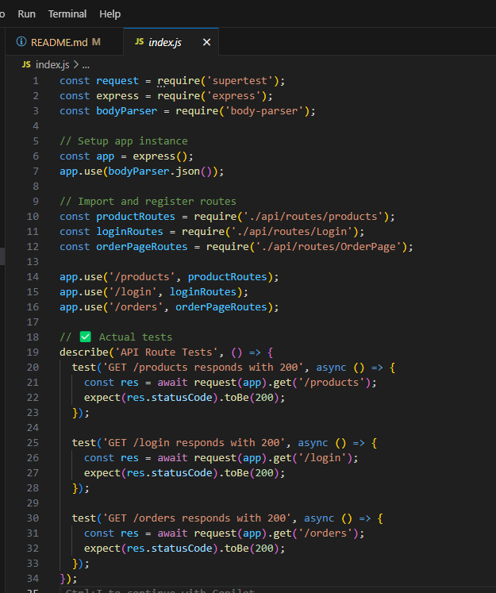
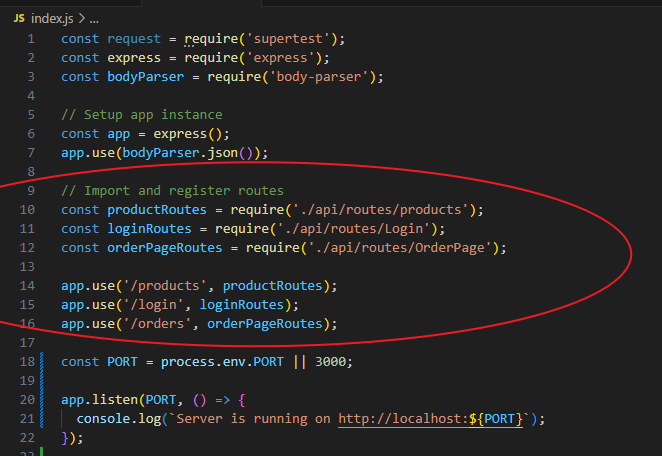

# Automating-Pipeline-for-an-E-commerce-Platform-Using-Github-Actions

The first step is creating a new directory `e-commerce-Platform using the following command 

 ## Project Setup

Next, we navigated into this directory and created 2 more directories 

1. `api` for the backend: handles product listings, user account and order processing  
2.  `webapp` for the front end: for users to browse products, manage their accounts and place orders. 

## Initializing Github Actions

 We navigated to `e-commerce-Platform` directory and initilized it as a git repository. This shows up as a hidden `.git` directory in the current folder. Initializing git enables git to track and monitor changes in this folder. 

We executed `npm init -y` to create a package.json

and `npm install` to create the lockfile and dependency `package-lock.json`

The next step is to create `.github/workflow` directory in our git repository. This directory will store our workflows files ( **YAML** configuration files ) for our CI/CD pipeline for automted testing and deployment. 

## Backend API Setup

To setup the backend, there is a series of application / packages we need need to install, JavaScript being one of them, it allows us to interact with our backend servers.

To get JavaScript running in our backend `api` directory, we need to create the `Node.js` environment - a runtime environment that lets us run JavaScript code.

To start a JavaScript runtime environment, `npm` - Node package manager is required. It helps to create a new `package.json` file, which sets up the project's dependencies, scripts, metadata and versioning that is essential for installing packages and deploying apps.

By running the command **npm init -y** we initializa a `Node.js` environment that is essential for JavaScript, this command automatically creates a `package.json` file

`npm install` installs dependencies `package-lock.json` file 

    *Note: we might run into an error "npm: command not found" when trying to execute the node package manager, this usually happens when *Node.js* and npm aren't installed on your computer*

    To install Node.js, go to <https://nodejs.org/en/download>,
    may need to close and reopen terminal for changes to take effect.

After successfully installing `Node.js`, we ran the following and initialized our JavaScript runtime environment.

 #### Installing Dependencies

 - Express
 - body-parser

`Express` a minimal and flexible web framework application for `Node.js` that creates our server, defines and handles routing, and handles  middleware for parsing data, authentication and more. 

 `body-parser` (optional): helps process JSON requeest bodies, making it easier to handle form submissions or API request

## Backend API setup - continuation

 The following file was manually created in our `api`

 
 
`index.js` is the entry point for our server, it sets up a working server that listens for requests and delegates handling to the correct routes. It’s the brain of the operation, routing requests to where they’re handled.

 and the code; 

Note: *Embedded in the code is an importer that imports router objects from `routes/products`, `routes/Login` and `routes/Orderpage`. Using the router with `app.use()` connects it to the route path* 

More of this later. 

**Other Core directories** 

- `routes`: Defines our API endpoints.

- `Controllers`: Handles logic for each route

- `models`: Structures data (especially useful when adding a database)

In the routes directory, - `routes/products.js` file was created. This file defines how our app handles product-related API request.

**product.js**

 **<u>Connection between routes files and index.js</u>**

In the `routes/products.js` core file, `module.exports` sends the router object out of the file, making it available for import in other parts of your app. 

Embedded in `index.js` code is an importer that imports router objects from the routes files 

Using the router with `app.use()` connect it to the route path. 
this tells express: whenever someone visits /products, use the logic inside `productRoutes` to respond.

The same goes for all other route pages.

Next, we ran the app by executing the file `index.js`. Hence, starting the full `Express` server, and delegating product-related traffic to the router defined in `products.js`

We tested the endpoints on the browser by going to 

    http://localhost:3000/products
 we have this 

*Note that we have created our back end with Express server which by default runs on `localhost:3000`*

**<u>Other route pages</u>**

**Login.js**

**OrderPage.js**

<u>Testing our endpoint on orders & login page</u>

Note: keep node.js server running in the background when making requests.

## Frontend Web Application Setup

### Building a React app that connects to backend API

We created a new directory for our frontend "webapp". Here, we installed a React application routing setup and essential libraries needed for our frontend

### Configuring Routing on the frontend

Routing on the frontend allows for bookmarkable and shareable URLs, providing easy access to specific pages and seamless navigation between different views within a single-page application (SPA), all without requiring a full browser reload.

Routing is done in the `src` directory, 

We created  components pages `Productlist`, `Login`, and `OrderPage` .
 

Navigating to the `src` directory, and in `App.js`, we configured routing. 

You can see circled part of the script that `src/pages` "Productlist, Login and OrderPage" are currently configured and then routing is defined.  

**App.js**

the configuration in each `src/pages`contains a function to fetch `products`, `login` and `OrderPage` from our backend api  

**ProductList.jsx**

The circled part of the code fetches our product data from our backend /api/products.
it Parses the response as JSON and updates the `products` state. Logs an error to the console if the fetch fails. 

**Login.jsx** contains the code 

**OrderPage.jsx** contains the code 

 

## Continuous Integration Workflow for Backend API

## Setting up Github workflow

In our backend api, create a new file, name it `build.yml` this is 

**Explanation of the script**

 <u>Step1: Checkout Action</u>

Checks out your repository so the workflow can access the code

 <u>Step 2: Set up Node.js</u>

This installs and configures the specifies Node.js version, in the workflow. We've used Node version 22

 <u>Step 3: Installs Dependencies</u>

Installs step uses a shell command (`npm ci`), "CI" means clean install. It installs dependices based on `package-lock.json`

<u>Step 4: Cache Node.js dependencies</u>

It caches Node.js dependencies to speed up builds by avoiding repetitive npm install runs.
It uses GitHub's caching action to store the `~/.npm` folder and creates a unique cache key based on the operating system and the `package-lock.json` file. If an exact match isn't found, it falls back to older cache versions with a partial key.
This facilitates faster builds, less downloading—more time for coding

 <u>Step 5: Run test</u>

Also a shell command (`npm test`). This executes the test suite.

Note that to run a test, a separate test file must be created named as `index.test.js`. And our `package.json` needs to define the test script.

As we see from the script above, `jest` a popular framework for testing is used.
We must install `jest` in our api directory for this to work. 

Here are the commnad needed to install Jest

`Supertest`: a Node.js library designed specifically for testing HTTP APIs, it helps simulate HTTP requests directly to Express app without needing external tools like Postman or Curl. Here is how we installed supertest. 

- Next we need to update the `index.test.js` file to include  jest test logic

The setup assumes routes supports `GET` requests and respond with status 200 for all API routes request.

To Run test simply use the command `npm test`

*Note that all routes `Login.js`, `OrdePage.js`, `products.js` must contain code to respond to `GET` request, otherwise an error would occur* 

<u>Step 6: Building the application</u>

Another shell command (`npm run build`). It tells the Node Package Manager (npm) to execute a script named `build` that's defined in the project's `package.json file`. The command prepares the workflow file `build.yml` ready for deployment.

Here again, we must update the `package.json` file with the build script

<u>Step 7: Set up Docker Buildx</u>

This It sets up Docker Buildx, an advanced tool for building Docker images.

<u>Step 8: Log in to DockerHub</u>

The calls the official docker action to log in, supplies DockerHub username and password, that is securly stored as a secret in 
settings -- Secrets and variables ---- Actions -- Repository Secrets

<u>Step 9: Build and Push Docker Image</u>

Here we push docker images to the DockerHub registry - a self contained platform - ensuring the image is ready for deployment whenever and wherever its needed. 

To push a docker image, we need a `Dockerfile`, we created and placed this file in our root repository. 

<u>Dockerfile: script Explanation</u>

- Specifies what base image we want to use from Docker. `node:22-alpine` lightweight official Docker image for Node.js version 22. 

- We set the working directory to `/app`, where Docker's default container's filesystem is located.

- The line `COPY package*.json ./` in the Dockerfile instructs Docker to copy any file from the current local directory that matches the pattern `package*.json` - typically `package.json` and `package-lock.json` - into the container’s working directory (/app). 

    *By isolating this step before installing dependencies with `npm ci`, Docker can cache the result of the installation.
    This means that if these files haven’t changed between builds, Docker will reuse the cached dependency layer—avoiding a fresh install and significantly speeding up the build process*

- `npm ci --only=production` excludes packages listed under `devDependencies` in our `package.json`. Installing only what is needed to run the app- not what's needed to develop or test it, hence, it speeds up run time for the production environment. 
 

- We copied the built files from our local `api` directory into the container's `/app/api` directory. 

- We've exposed our app to port 3000, the default express server port our app (index.js) listens to. 

- Finally, runs the `node api/index.js` application when the container starts up

Once `Dockerfile` is created, the rest of the code is executed to build the image, tag it and push to DockerHub account, 
its image is tagged as `my-node-app:latest`

## Continuous Deployment Workflow Our Backend API

## Setting up Github Workflow 

